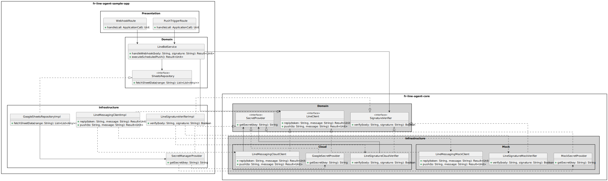

# Class Diagram: Full Layered Structure (Strict T-B Layout)

This diagram shows the complete class members and their strict hierarchical
relationships, ensuring that logic flow and dependency directions are clear.

