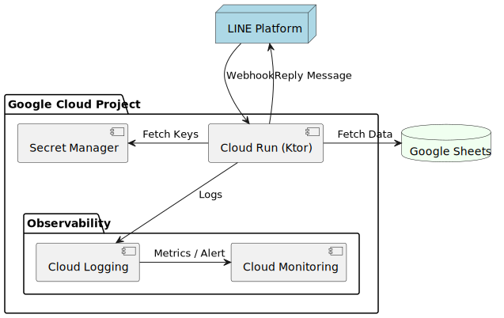

# System Architecture Diagram

The FRLineAgent project utilizes a serverless architecture centered on Google Cloud Run.

- Cloud Run (Ktor): The core backend engine executing business logic. It handles incoming webhooks and scales automatically.
- Google Sheets API: Serves as the primary data source. The Ktor application fetches required information dynamically using a Service Account.
- Secret Manager: Securely stores sensitive information such as the Channel Secret and Channel Access Token for the LINE Messaging API.
- Cloud Logging / Monitoring: Automatically collects application logs from stdout. It provides real-time error reporting and performance monitoring.

