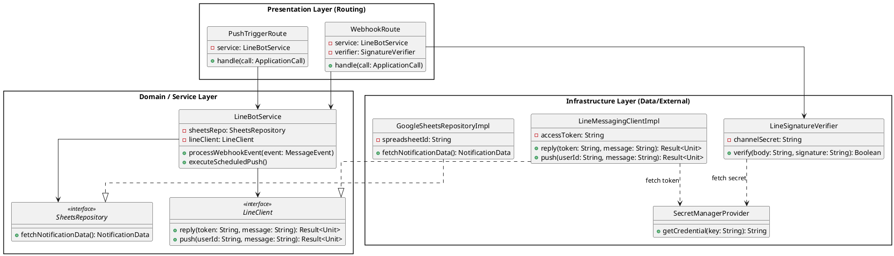

# Class Diagram: Layered Architecture

This class diagram defines the structure using Layered Architecture.
Interfaces are used to ensure high testability.

```plantuml
@startuml
skinparam style strictuml
skinparam linetype ortho
skinparam packageStyle rectangle

package "Presentation Layer (Routing)" {
    class WebhookRoute {
        - service: LineBotService
        - verifier: SignatureVerifier
        + handle(call: ApplicationCall)
    }
    class PushTriggerRoute {
        - service: LineBotService
        + handle(call: ApplicationCall)
    }
}

package "Domain / Service Layer" {
    class LineBotService {
        - sheetsRepo: SheetsRepository
        - lineClient: LineClient
        + processWebhookEvent(event: MessageEvent)
        + executeScheduledPush()
    }
    
    interface SheetsRepository <<interface>> {
        + fetchNotificationData(): NotificationData
    }
    
    interface LineClient <<interface>> {
        + reply(token: String, message: String): Result<Unit>
        + push(userId: String, message: String): Result<Unit>
    }
}

package "Infrastructure Layer (Data/External)" {
    class GoogleSheetsRepositoryImpl {
        - spreadsheetId: String
        + fetchNotificationData(): NotificationData
    }
    
    class LineMessagingClientImpl {
        - accessToken: String
        + reply(token: String, message: String): Result<Unit>
        + push(userId: String, message: String): Result<Unit>
    }
    
    class LineSignatureVerifier {
        - channelSecret: String
        + verify(body: String, signature: String): Boolean
    }
    
    class SecretManagerProvider {
        + getCredential(key: String): String
    }
}

' Relationships & Dependency Inversion
WebhookRoute --> LineBotService
PushTriggerRoute --> LineBotService
WebhookRoute --> LineSignatureVerifier

LineBotService --> SheetsRepository
LineBotService --> LineClient

' Implementation of Interfaces
GoogleSheetsRepositoryImpl ..|> SheetsRepository
LineMessagingClientImpl ..|> LineClient

' Infrastructure using Shared Resources
LineMessagingClientImpl ..> SecretManagerProvider : fetch token
LineSignatureVerifier ..> SecretManagerProvider : fetch secret

@enduml
```