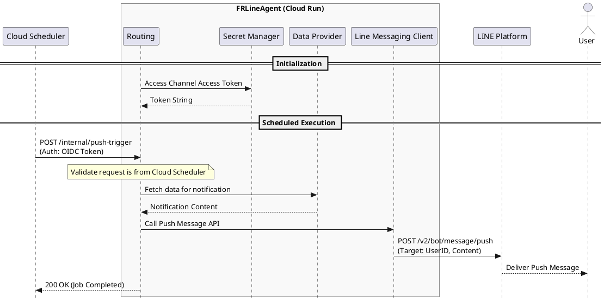

# Sequence Diagram: Scheduled Push Notification

This diagram illustrates the flow of sending automated messages to users based on a Google Cloud Scheduler trigger.

```plantuml
@startuml
skinparam style strictuml
skinparam MaxMessageSize 200

participant "Cloud Scheduler" as Scheduler
box "FRLineAgent (Cloud Run)" #f9f9f9
    participant Routing
    participant "Secret Manager" as SM
    participant "Data Provider" as Provider
    participant "Line Messaging Client" as Client
end box
participant "LINE Platform" as LINE
actor User

== Initialization ==
Routing -> SM: Access Channel Access Token
SM --> Routing: Token String

== Scheduled Execution ==
Scheduler -> Routing: POST /internal/push-trigger\n(Auth: OIDC Token)

note over Routing: Validate request is from Cloud Scheduler

Routing -> Provider: Fetch data for notification
Provider --> Routing: Notification Content

Routing -> Client: Call Push Message API
Client -> LINE: POST /v2/bot/message/push\n(Target: UserID, Content)
LINE --> User: Deliver Push Message

Routing --> Scheduler: 200 OK (Job Completed)

@enduml
```