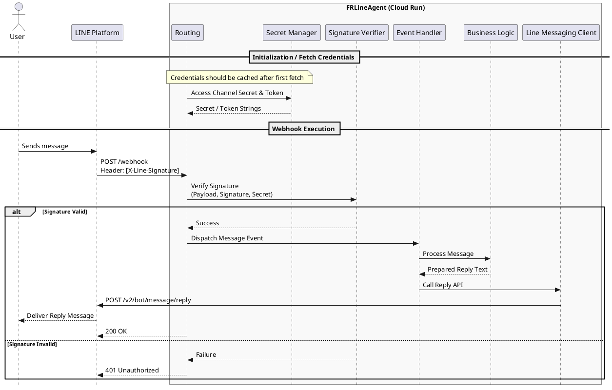

# Sequence Diagram: LINE Webhook Processing

This diagram illustrates the flow from receiving a LINE message to sending a reply, including signature verification and credential retrieval from GCP Secret Manager.

